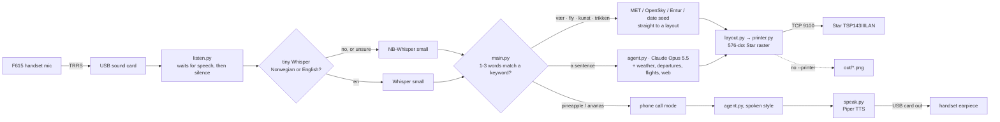
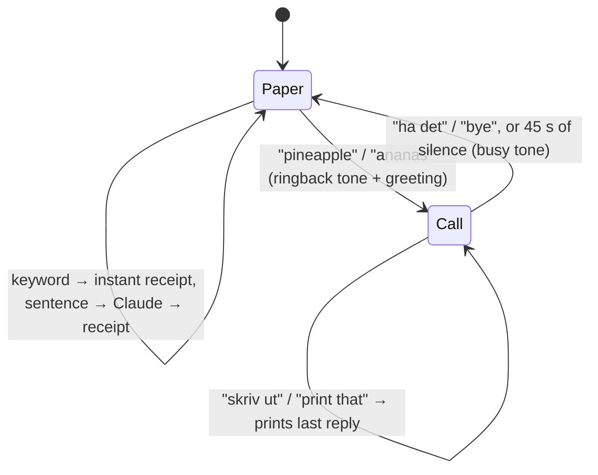
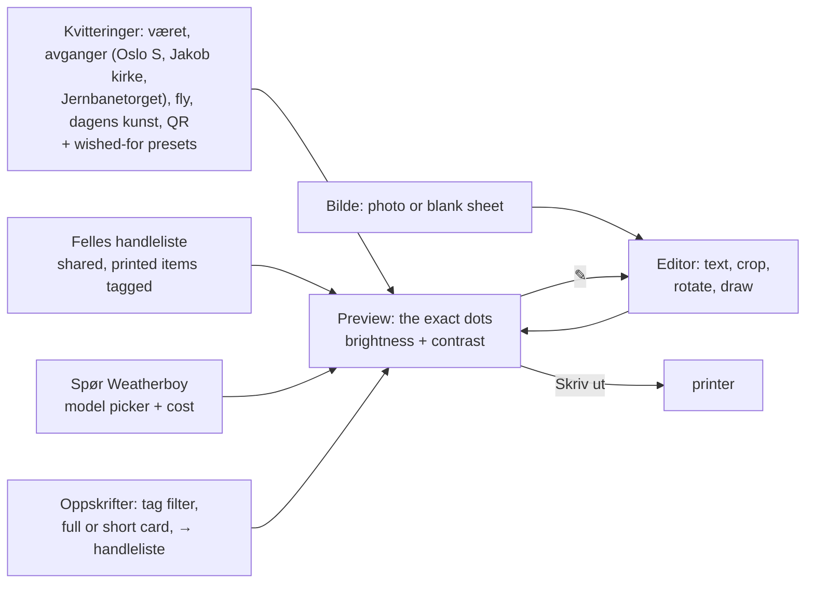
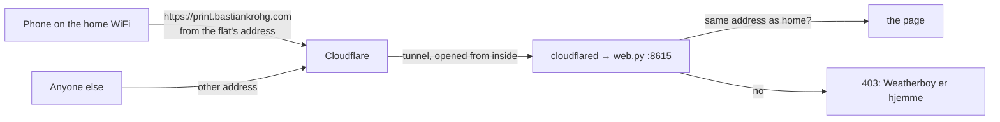
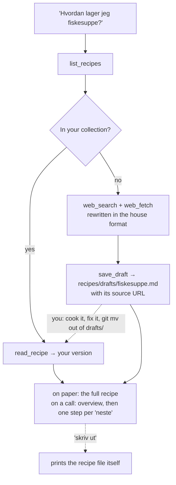
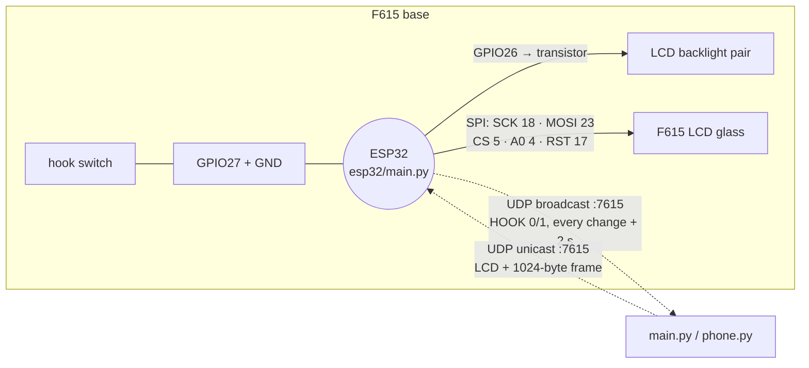
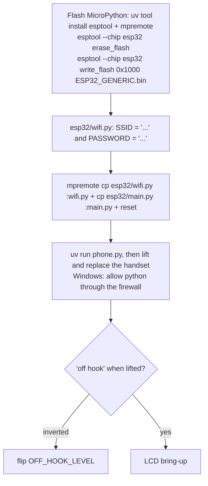
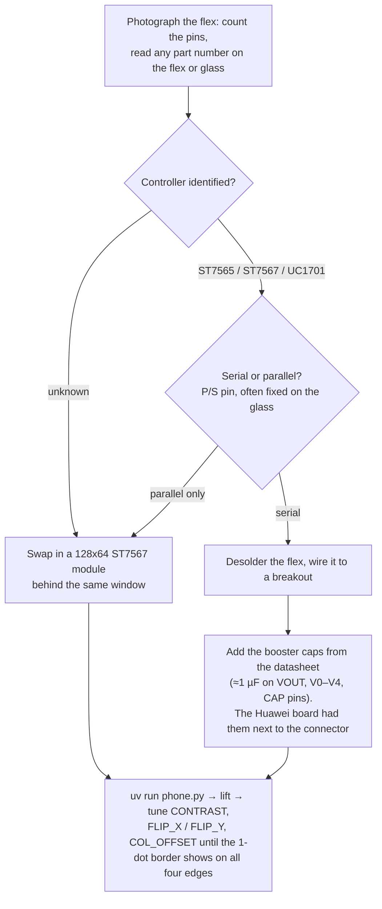
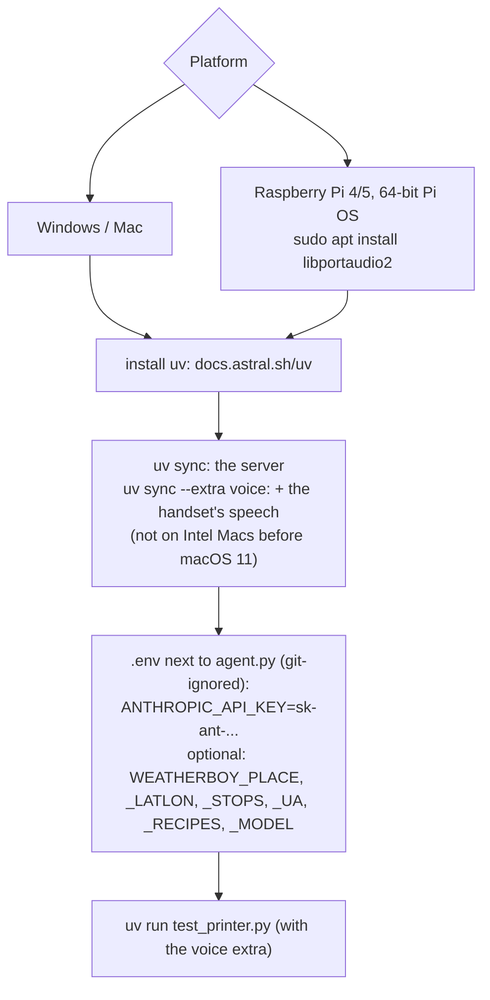
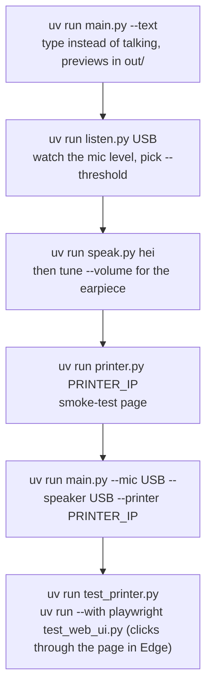

# Weatherboy

Speak into an old phone handset. Short keywords print a receipt straight away, full questions go to Claude and get printed, and a password turns it into a phone call.

## How it works




The printer's USB-A port only supplies power, and its RJ port is for a cash drawer, so don't plug the handset into it. Bring-up steps are in [pos_printer.md](pos_printer.md#8-hardware-in-hand-2026-09-29-its-the-lan-model).

**Self-test page:** power off, then hold FEED while powering on. The page shows the printer's IP, MAC and settings, and doubles as a print-head check.

**Reset the network settings** (no IP, or a `169.254.x.x` one):

1. Power off and open the cover.
2. Hold FEED while powering on, and keep holding until the lights blink.
3. When the lights blink alternately blue and red, power off and on again. It's back on DHCP.

`uv run printer.py <ip> status` checks it from the computer: `ready`, or what's wrong.

## Phone call mode



| Say | You get |
|---|---|
| `vær` · `weather` · `yr` | Weather card: now, 24 h temperature curve, rain bars |
| `trikken` · `bussen` · `avganger` | Departure board for the first of `WEATHERBOY_STOPS` (default: trains from Oslo S; the page also offers Jakob kirke and Jernbanetorget) |
| `fly` · `radar` · `planes` | Radar plot of aircraft within 40 km |
| `kunst` · `art` | Today's 10 PRINT or Truchet maze (same date, same print) |
| `skriv ut` · `print that` | Reprint the last answer |
| anything longer | Claude answers on paper |

## Web page

`main.py` also serves a page on port 8615: `http://<this machine>:8615` from any phone or laptop on the WiFi. `uv run web.py --printer <ip>` runs just the page.



Every receipt is an image, and the ✎ opens it in one editor: fix the text of answers, recipes and lists, crop, rotate between portrait and landscape, and draw (Apple Pencil pressure works on an iPad). Brightness and contrast apply to every print; on text they make strokes thinner or bolder. "Ønsk deg en kvittering" asks Claude to add a new preset button: it only saves a prompt, never code. The shared shopping list and the presets live in `data/` (git-ignored).

The dot in the header is green when the printer is ready, yellow when it's on the network but won't print (cover open, out of paper, busy), and red when it can't be reached. "QR-lapp til veggen" prints the page's address as a QR code; reprint it if the machine's IP changes. Nothing prints until you press "Skriv ut", except the **daily prints**: the day's art and a **word of the day** (Korean A2 by default; French, Italian, Spanish, Portuguese, a Chinese character or a Japanese kanji), switched on and off, and timed (12:00 by default), in the "Daglig utskrift" card. If the printer is off or out of paper they're retried every minute until 22:00, and nothing prints twice a day. The word is one small Claude Haiku call a day, cached; Korean, Chinese and Japanese print in fonts that have those scripts (on a Pi: `sudo apt install fonts-noto-cjk`). Photos are rotated upright and Atkinson-dithered to 576 dots; text is thresholded. There's no login, so anyone on the network can print.

**Phones can't connect?** On Windows the firewall blocks it. Allowing "python.exe" doesn't last, because uv's Python lives in versioned folders. Allow the port instead, once, in an administrator PowerShell:

```powershell
New-NetFirewallRule -DisplayName "Weatherboy web page (TCP 8615, local network)" -Direction Inbound -Action Allow -Protocol TCP -LocalPort 8615 -RemoteAddress LocalSubnet -Profile Private,Public
```

It only admits devices on your own network. A Pi or Mac needs nothing.

**Still timing out?** Then the phone's requests never arrive, and the router is keeping WiFi devices apart: turn off "client isolation" / "AP isolation" in its WiFi settings (http://192.168.0.1 on Telia routers). A server on a cable (like the printer, or a Pi) is usually reachable even with isolation on.

### From anywhere at home, through a tunnel

Our router keeps WiFi devices apart (AP isolation), so phones reach the page through a Cloudflare Tunnel instead: **https://print.bastiankrohg.com**. Only visitors coming from the flat's own internet address get in, so everyone on the home WiFi does and nobody else does. "Home" is wherever the printer answers: the address is only learned there, and kept in `data/hjemme.json`, so a laptop taken to the university doesn't let the university in.



Once per machine: `cloudflared tunnel login` (pick the domain in the browser), `cloudflared tunnel create weatherboy`, `cloudflared tunnel route dns weatherboy print.<domain>`, and a `~/.cloudflared/config.yml` sending that hostname to `http://localhost:8615`. Then `uv run web.py --printer <ip> --tunnel weatherboy` runs both, and `WEATHERBOY_PUBLIC_URL` in `.env` puts the address on the QR label.

## Recipes

Your recipes live in their own git repo, `recipes/` (git-ignored here), or wherever `WEATHERBOY_RECIPES` points. One Markdown file per dish, in the format in [recipes/README.md](recipes/README.md).



Get it with `git clone git@github.com:bastiankrohg/recipes.git recipes`, or clone anywhere and point `WEATHERBOY_RECIPES` at it. Drafts made on the Pi come home with `git push`. Recipes print as a kitchen card with tick boxes on the receipt printer, and on A4 via the collection's own `print.py`.

## ESP32 in the F615 base (optional, `--phone`)

The mic only listens while the handset is lifted. Lifting gives a dial tone and hanging up ends a call, even mid-sentence. The phone's own LCD shows a clock, then what it heard and what it's doing.





Firmware from [micropython.org/download/ESP32_GENERIC](https://micropython.org/download/ESP32_GENERIC/). C3/S3 boards flash at offset `0` and need different pins.

### LCD bring-up

The FCC photos show a monochrome graphic LCD with a separate LED backlight pair. Its roughly 20-pin flex cable is soldered to the Huawei board. That usually means an ST7565 / ST7567 / UC1701-family controller, which is what the firmware assumes. It is **unconfirmed**.



The swap-in module speaks the same protocol, so nothing changes on the host.

## Models: Claude or free and local

The model picker on the page (or `WEATHERBOY_MODEL` in `.env`) chooses who answers questions:

| Choice | Cost | Notes |
|---|---|---|
| `local` | free | Ollama, or anything with an OpenAI-style chat API and tool calls, on the work desktop over Tailscale, else on this machine (`WEATHERBOY_LOCAL_URLS`, `WEATHERBOY_LOCAL_MODEL`, default `qwen3:8b`). Gets Weatherboy's own tools, plus free web search (DuckDuckGo, or your own SearXNG via `WEATHERBOY_SEARXNG_URL`) and page reading limited to public addresses |
| `claude-haiku-4-5` | ≈ $0.005 a question | Default today; web search included |
| `claude-sonnet-5-5`, `claude-opus-5-5` | more | Wished-for presets are always designed by Sonnet 5.5 |

Ollama only listens on its own machine by default. To share it with the tailnet and nobody else, run this once on the desktop (Ollama itself stays on localhost):

```sh
tailscale serve --bg --tcp 11434 tcp://localhost:11434
ollama pull qwen3:8b        # or a bigger one with tool calling if the GPU allows: Norwegian improves with size
```

## Transcripts from anywhere: `/api/voice`

Any speech-to-text pipeline (a phone app, another machine with the handset) can hand Weatherboy a transcript and get the same routing as the handset: keyword receipts, the call password, questions to the model, "skriv ut".

```sh
curl -X POST https://print.bastiankrohg.com/api/voice -d '{"text": "hvordan blir været i kveld", "call": false}'
```

The reply says what happened (`kind`: card, answer, call, hangup, print, ignored), with `say` for anything to speak back and `printed`. Inside a call (`"call": true`) answers are short and spoken instead of printed. The same home-only rule applies.

## Running on the MacBook Pro (2012, macOS 10.15)

The server runs there; the handset's speech needs a newer machine (onnxruntime has no Intel-Mac builds, PyAV needs macOS 11), which can send transcripts to `/api/voice` instead.

```sh
curl -LsSf https://astral.sh/uv/install.sh | sh
git clone git@github.com:bastiankrohg/weatherboy.git && cd weatherboy
git clone git@github.com:bastiankrohg/recipes.git recipes
uv sync                                   # server only
cp /path/to/.env .                        # ANTHROPIC_API_KEY, WEATHERBOY_PUBLIC_URL, WEATHERBOY_MODEL=local ...
```

For the tunnel, install `cloudflared` (`brew install cloudflared`, or the `darwin-amd64` release), copy `~/.cloudflared/` from the Windows laptop (`cert.pem`, the tunnel's `<id>.json` and `config.yml`, with `credentials-file:` pointing at the new path), then:

```sh
uv run web.py --printer 192.168.0.217 --tunnel weatherboy
```

`caffeinate -s` in front keeps the Mac from sleeping. Only one machine should run the tunnel at a time.

## Setup

**You need your own Claude API key.** Get one at [console.anthropic.com](https://console.anthropic.com), then create a file called `.env` next to `agent.py` containing:

```
ANTHROPIC_API_KEY=sk-ant-...
```

`.env` is git-ignored, so the key never ends up in the repo. Without it, the keyword receipts, photos and recipes still work, but chat and phone calls don't.



Whisper models and Piper voices download from Hugging Face the first time they're used.

## Run



| Flag | Default | Notes |
|---|---|---|
| `--lang` | `auto` | `no` or `en` loads one model instead of three (lighter on a Pi) |
| `--model` | `NbAiLab/nb-whisper-small` | `NbAiLab/nb-whisper-base` is 3x faster on a Pi |
| `--en-model` | `small` | Stock Whisper for English |
| `--password` | `pineapple,ananas` | Starts a call. A party trick, not security |
| `--volume` | `0.5` | Earpiece gain |
| `--threshold` | `0.02` | RMS level that counts as speech |
| `--mic` / `--speaker` | system default | Device index or part of its name |
| `--phone` | off | Use the ESP32 hook switch and LCD in the F615 base |
| `--web` | `8615` | Web page port, `0` turns it off |
